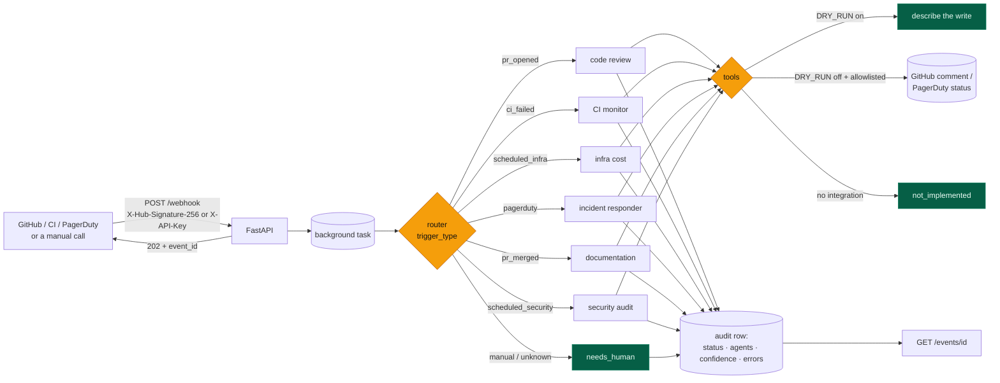

# DevOps OS

[](https://github.com/daniellopez882/DevOps-AI-Engineer-Agent/actions/workflows/ci.yml)


A webhook-driven router that hands CI/CD, review, incident and infrastructure
events to six specialist agents (LangGraph for routing, crewai for the
agents), records every run in an audit trail, and — by default — **describes
what it would do instead of doing it**.

## At a glance

| | |
|---|---|
| **Does** | Verify a signed webhook → route by trigger → run one specialist → record the outcome (`completed` / `needs_human` / `failed`) with the confidence the model reported, or none |
| **Writes outside itself** | Only with `DRY_RUN=false` **and** the repository on `ALLOWED_REPOS`: a pull-request comment, or a PagerDuty acknowledge / resolve / note |
| **Refuses** | Unsigned or unkeyed events; unknown triggers; a PR event without `pr_number`; a PagerDuty event without `incident_id`; production without an inbound secret |
| **Not implemented** | CI log fetching, security scanning, documentation updates. The tools say `not_implemented` — they used to return a hardcoded log, a fabricated CVE and "Successfully updated" |
| **Tests** | 94 — none reach a network, a model, GitHub, PagerDuty or AWS |
| **CI** | lint · tests on 3.11/3.12 · `DRY_RUN` asserted on by default · server booted and its contract exercised · bandit (fails the job) · gitleaks · container built, non-root, refused on an open production config |

## Architecture



### One event

```mermaid
sequenceDiagram
    autonumber
    participant S as Sender
    participant A as API
    participant G as Graph
    participant C as Specialist (crewai)
    participant X as GitHub / PagerDuty
    participant DB as Audit trail

    S->>A: POST /webhook + signature
    A->>A: verify HMAC-SHA256 (or X-API-Key); validate trigger, repo, size
    A-->>S: 202 {event_id, status: queued, dry_run}
    A->>DB: start_run(event_id)
    A->>G: invoke(state)
    G->>G: route by trigger; refuse if an identifier is missing
    G->>C: task
    C->>X: tool call
    alt DRY_RUN (default)
        X-->>C: "dry_run: would post … / would resolve …"
    else live and allowlisted
        X-->>C: done
    end
    C-->>G: JSON (parsed; confidence kept only if reported)
    G->>DB: finish_run(status, agents, confidence, errors)
    S->>A: GET /events/{event_id}
    A-->>S: the audit row
```

## Quick start

```bash
python -m venv .venv && . .venv/bin/activate     # Windows: .venv\Scripts\activate
pip install -r requirements.txt
cp .env.example .env                              # set API_KEY or WEBHOOK_SECRET, and a provider key
uvicorn main:app --reload
```

Send an event and read its outcome:

```bash
curl -s -X POST http://127.0.0.1:8000/webhook -H "X-API-Key: $API_KEY" -H "Content-Type: application/json" \
  -d '{"trigger_type":"pr_opened","repo":"octo/repo","payload":{"pr_number":42}}'
# {"event_id":"…","status":"queued","trigger_type":"pr_opened","dry_run":true}
curl -s http://127.0.0.1:8000/events/<event_id>
```

GitHub deliveries are verified with `WEBHOOK_SECRET` over the raw body
(`X-Hub-Signature-256`). The body schema is this service's own — see
Limits.

### Containers

```bash
docker build -t devops-os .
docker run --rm -p 8000:8000 --env-file .env -v devops-data:/app/data devops-os
# or the API plus Postgres:
POSTGRES_PASSWORD=… docker compose up --build
```

With `ENVIRONMENT=production` and neither `WEBHOOK_SECRET` nor `API_KEY` set,
the container exits non-zero instead of serving an open webhook.

## Configuration

| Variable | Default | Notes |
|---|---|---|
| `WEBHOOK_SECRET` · `API_KEY` | *(empty)* | At least one is required in production |
| `DRY_RUN` | **`true`** | Writes are described, not performed. A blank value keeps the default |
| `ALLOWED_REPOS` | *(empty)* | Exact `owner/name` list the GitHub tools may touch. Empty = none |
| `ANTHROPIC_API_KEY` · `ANTHROPIC_MODEL` | — · `claude-sonnet-5` | Review, incident, documentation, security agents |
| `OPENAI_API_KEY` · `OPENAI_MODEL` | — · `gpt-4o` | CI and infrastructure agents |
| `GITHUB_TOKEN` · `PAGERDUTY_API_KEY` · `PAGERDUTY_FROM_EMAIL` · `AWS_*` | — | Only used when the corresponding tool runs live |
| `DATABASE_URL` | `sqlite:///./devops_os.db` | Audit trail; Postgres via compose |

## API

| Route | Auth | Purpose |
|---|:-:|---|
| `POST /webhook` | signature or key | `{"trigger_type", "repo"?, "branch"?, "commit_sha"?, "payload"?}` → `202` with an event id |
| `GET /events/{id}` | — | The audit row: status, agents, confidence, errors, dry-run flag |
| `GET /health` · `GET /ready` | — | Liveness · readiness with per-check detail (database, auth, providers, write mode) |

Triggers: `pr_opened`, `ci_failed`, `scheduled_infra`, `pagerduty`,
`pr_merged`, `scheduled_security`, `manual` (recorded for a human; nothing
runs).

## What changed, and why

Every defect below was reproduced on the original code before it was fixed.

| # | Defect | Effect |
|--:|---|---|
| 1 | `POST /webhook` accepted any caller and any `trigger_type` | `{"trigger_type":"nonsense"}` from anyone → `200 accepted` |
| 2 | PagerDuty tool: `"acknowledged" if action == "acknowledge" else "resolved"` | An agent told to "escalate via note" **resolved the incident** |
| 3 | `incident_id` defaulted to `INC0001`; `pr_number` to `1` | A PagerDuty event without an id acted on INC0001; a PR event without a number reviewed and commented on PR #1 |
| 4 | `fetch_ci_logs` returned a hardcoded `ModuleNotFoundError` log for any id | The CI agent diagnosed fiction |
| 5 | `security_scan` returned a hardcoded `CVE-2024-xyz` for any repo | The security agent reported fiction |
| 6 | `update_documentation` returned "Successfully updated" and did nothing | Fake success into the audit log |
| 7 | `confidence=0.99` written to the audit log for every run | Including runs that routed nowhere |
| 8 | No allowlist, no dry run | Any model output could comment on any PR the token reached |
| 9 | The router appended to `messages` in place and returned the list | Under `add_messages` the history doubled every step (4 messages where 2 were expected) |
| 10 | `state.get("repo", payload.get("repo"))` | The key exists as `None`, so the fallback never ran |
| 11 | `build_agent_prompt` joined with `"\\n\\n"` | Every agent's system prompt contained the literal text `\n\n` instead of a line break |
| 12 | Six model clients built per node, `claude-3-5-sonnet-20240620` hardcoded | Every node needed both providers' keys; the Anthropic model is retired |

<details>
<summary>Also</summary>

Exceptions printed and swallowed (a failed run left no record); `print` everywhere; `datetime.utcnow`; the engine created at import; `event.dict()`; a root-running image that `COPY . .`'d the whole tree (a local `.env` included); compose with a hardcoded database password and the source mounted into the container; no `/health`, no `/ready`, no way to learn what happened to an event; an API description promising "50-year engineering expertise"; a README naming models the code hardcoded elsewhere and a human-in-the-loop the code never implemented.

</details>

## Design notes

| Record | Decision |
|---|---|
| [ADR 0001](docs/adr/0001-dry-run-by-default.md) | Dry run is the default; writes need an allowlist |
| [ADR 0002](docs/adr/0002-signed-webhooks.md) | Every event is signed or keyed, validated, and answered with an id |
| [ADR 0003](docs/adr/0003-refuse-to-guess.md) | Missing identifiers are refusals, not defaults; tools without an integration say so |
| [Threat model](docs/threat-model.md) | Assets, seven threats, what is not addressed |

## Layout

```
main.py                  FastAPI: signed /webhook, /events/{id}, /health, /ready
security.py              HMAC-SHA256 signature and API-key checks
agent_graph.py           router + six nodes; refusals; audit start/finish
crew_agents.py           one crewai agent per specialist, one model each
tools.py                 GitHub, PagerDuty, AWS Cost Explorer; honest stubs
llm.py                   crewai LLM factories with explicit keys; the test seam
database.py              audit rows (SQLModel); redaction
config.py                settings; DRY_RUN default True
tasks.py                 crewai task descriptions
devops_agent_prompts.py  the agent prompts
tests/                   94 tests
docs/                    ADRs, threat model
```

## Limits

- The webhook body is this service's schema, not GitHub's native payload. A real GitHub webhook needs a small translator in front (map `pull_request.opened` → `pr_opened` etc.); the signature check already matches GitHub's.
- Events run as FastAPI background tasks in one process: no queue, no retry, no concurrency limit.
- Three of the seven tools have no integration and say so. Nothing here has been run against a model.
- The prompts describe controls (Terraform plan/apply gates, cost thresholds, dead-letter queues) that the code does not implement. `DRY_RUN`, the allowlist and the refusals are what exists.

## Licence

MIT — see [LICENSE](LICENSE).
